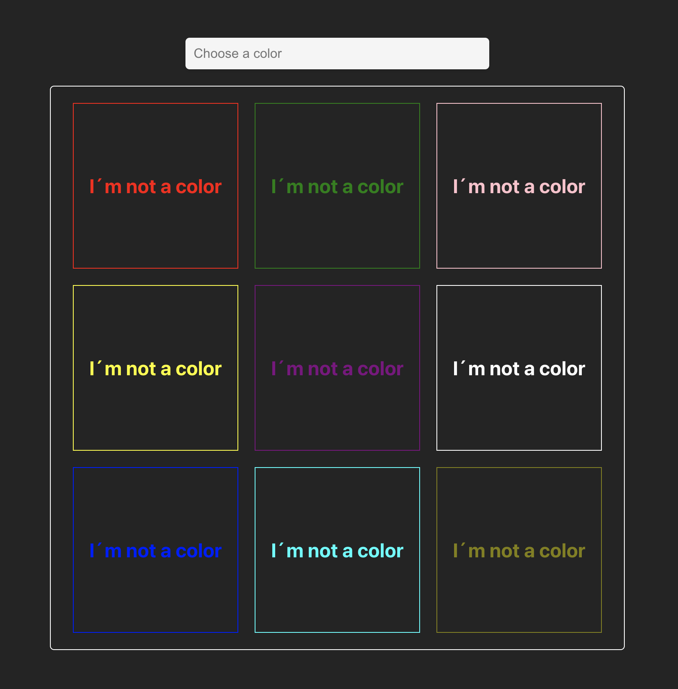
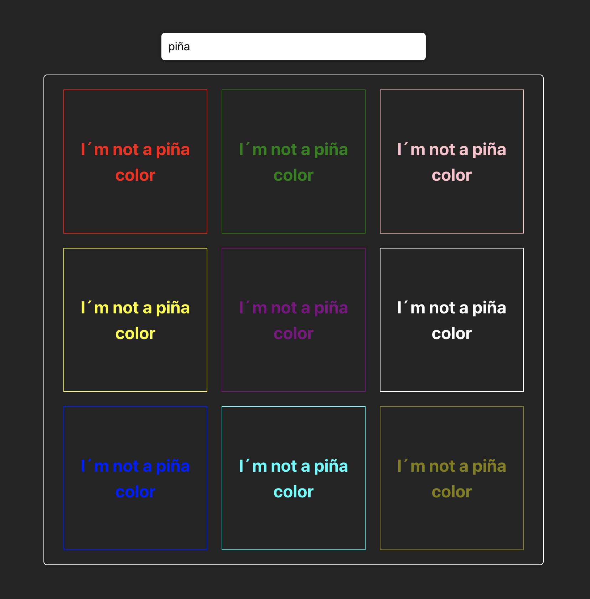
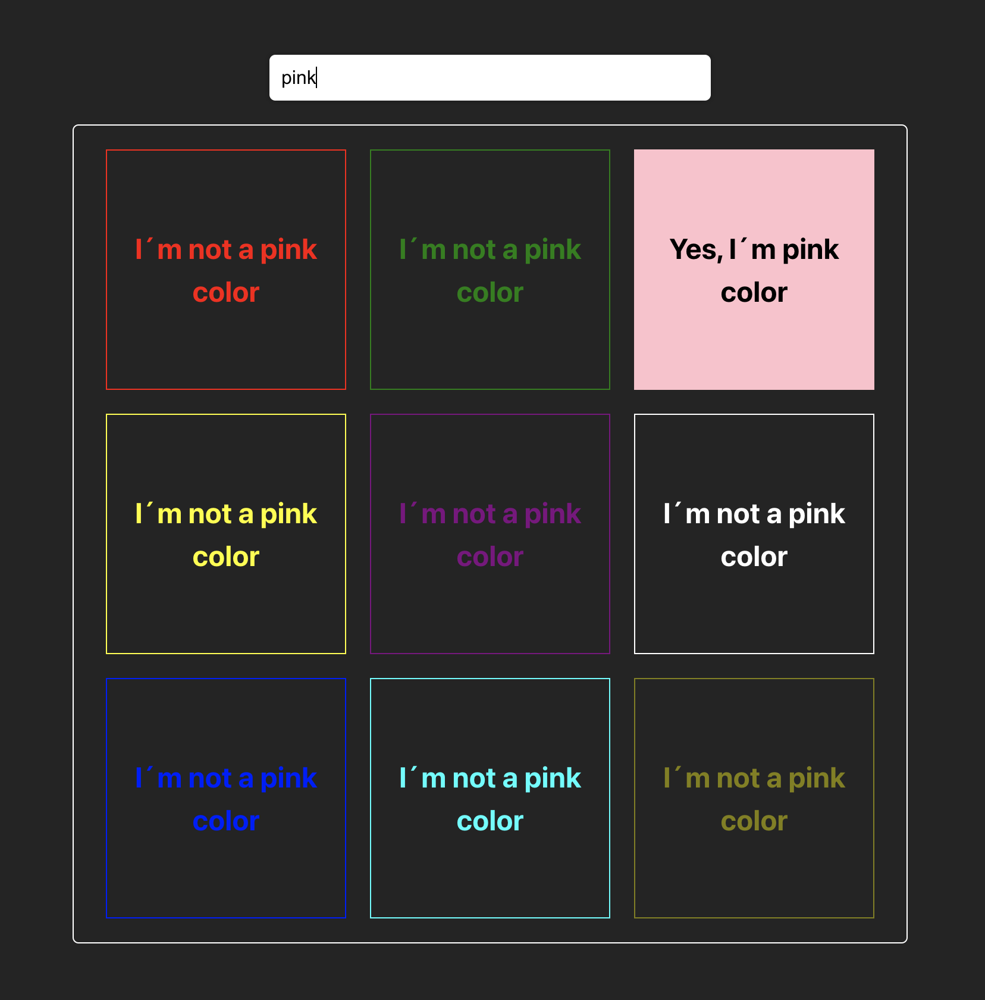
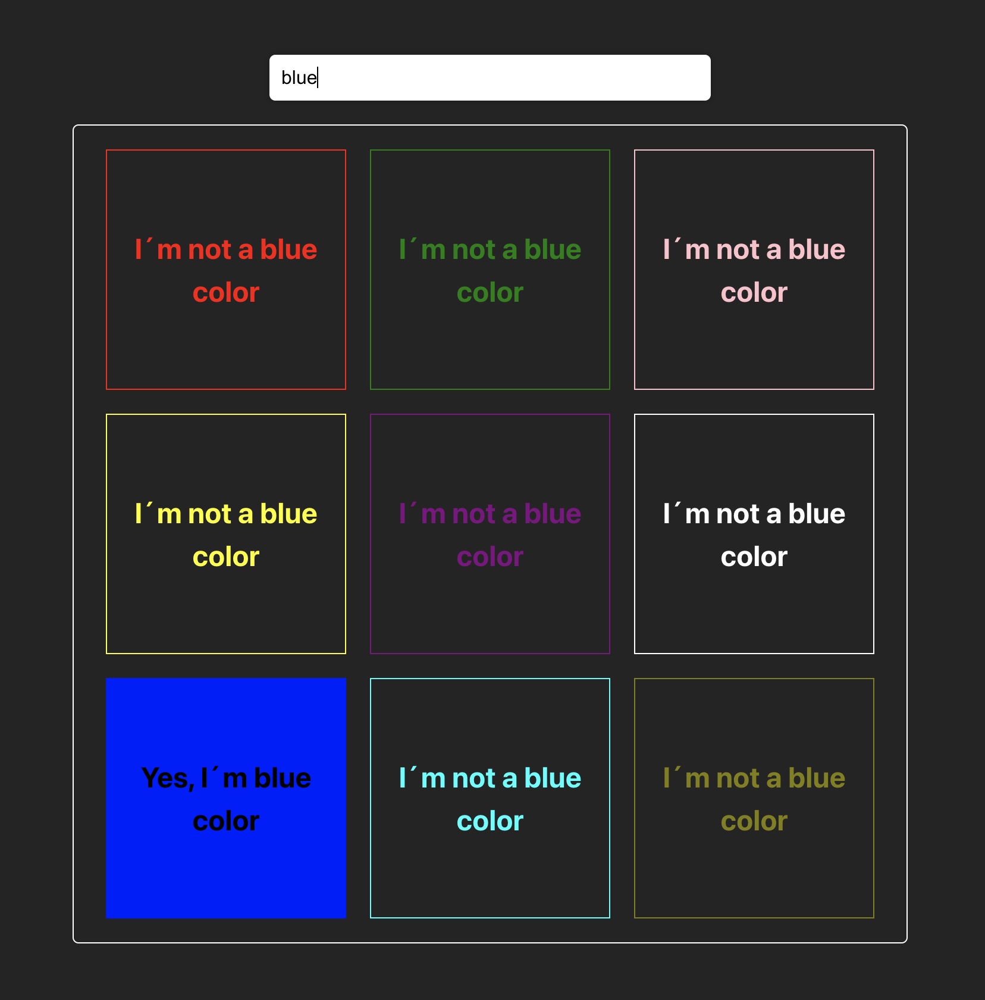
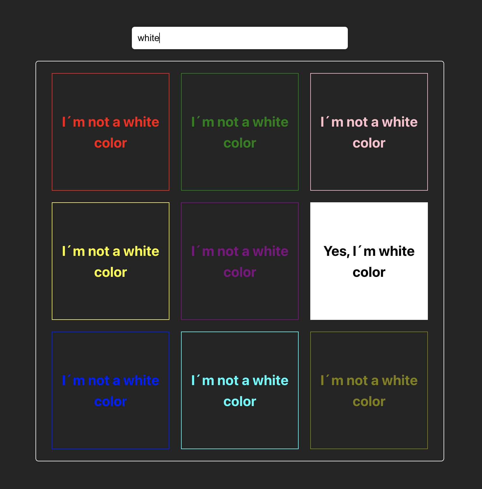

# Input box colors
Con este ejercicio vamos a aprovechar el hook `useRef` para acceder a los atributos de los elementos.
Como siempre instala las dependencias con `npm i` antes de empezar

## Objetivo

Tendremos 9 cuadros de colores donde cada uno tendrá un color diferente, aquí tienes un array de colores que podrás usar en el ejercicio si lo ves necesario

```js 
const colors = ['red', 'green', 'pink', 'yellow', 'purple', 'white', 'blue', 'aqua', 'olive'];
```

También tendremos un input en el que escribiremos el color para hacer que coincida.
El funcionamiento es el siguiente:
- Si escribimos un color que está en la lista, el cuadro de ese color tendra el fondo de ese color.
- Si el color (palabra que se escribe en el input) no coincide con el color, no cambiara ningun fondo.
- Mientras se escribe el color, ese valor del input irá cambiando en el texto dentro de cada cuadro.
- Tendremos 2 textos: Uno que diga que no soy el color y cambiará el texto cuando coincida el color.

Se adjuntan imagenes de ejemplo para entender mejor el funcionamiento:










## Estructura

Tendremos 2 componentes en la carpeta `components`:
- `BoxColor.jsx`: Aquí irá el componente del cuadrado de color.
- `MyFormChallenge.jsx`: Aquí crearemos el formulario e importaremos las BoxColor para pasarle `props`.

Como siempre en `App.jsx` pondremos nuestra aplicación

## PISTAS
- Usa el array de colores... seguro que tiene más de un uso
- Accede a la clase de cada `BoxColor` y compara ese atributo con el valor que nos da el input para poder cambiar ese color y texto. El aspecto del `className` cada box podría tener un aspecto similar a esto:

```js 
className={`box ${color}`}
```
Cuidado con lo que comparas... Puede que falte algo en el valor que llega del input con la lista de clases del elemento. Fíjate en el ejemplo del aspeto que tiene el `className`

- Tendremos que trabajar con clases para jugar con esos colores. Tienes unas css de inicio dentro de `App.css`, como por ejemplo `box`. Revísalas y añade más, cambialas, ... Si lo ves necesario. Sino, siempre podrás añadirlas en línea dentro del componente. Tal vez sea más fácil para ciertas cosas.